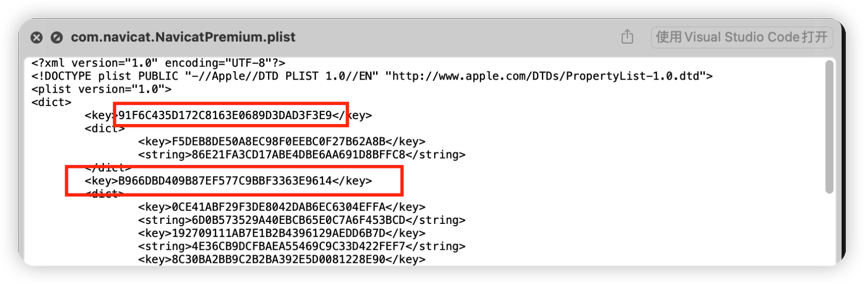
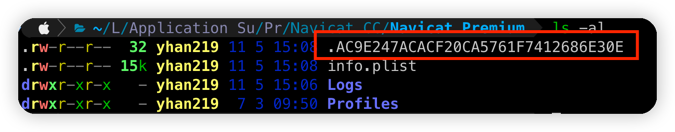

# Navicat 16/17 Mac Version Unlimited Trial Reset Script

<!-- @import "[TOC]" {cmd="toc" depthFrom=1 depthTo=6 orderedList=false} -->

## Disclaimer

**This script is free for personal use only. It must be used strictly in compliance with the open-source license agreement. Commercial use and any profit-making activities are strictly prohibited. The author is not responsible for any consequences arising from illegal usage!**

## Script Declaration

- **This script is designed for macOS systems and does not support Windows.**
- **If you encounter any issues, please submit an [Issue](https://github.com/yhan219/navicat_reset_mac/issues).**

## Usage Instructions

1. Download the latest version from the [Navicat Premium](https://www.navicat.com.cn/download/navicat-premium) official website. Install and launch it, then select the 14-day trial.
2. After the trial expires, run the reset script: Double-click `reset_navicat.command`, or Execute `./reset_navicat.sh` in the terminal.

## Notes

- **Backup your data before use**: Go to `File > Export Connections > Select All > Export Passwords` to back up all data.
- **Supports the latest version**.
- **Supports the English version**.

## Principle Explanation

- **Delete trial data** in `~/Library/Preferences/com.navicat.NavicatPremium.plist` by removing top-level keys matching 32-character hash formats (e.g., `91F6C435D172C8163E0689D3DAD3F3E9`, `B966DBD409B87EF577C9BBF3363E9614`, `014BF4EC24C114BEF46E1587042B3619`).  
  Preview example (press Space to view):  
  

- **Delete hidden files** starting with `.` in `~/Library/Application Support/PremiumSoft CyberTech/Navicat CC/Navicat Premium/`.  
  Example:  
  

- For implementation details, refer to [reset_navicat_old.sh](reset_navicat_old.sh).

## Troubleshooting

If the script does not work, follow these steps:

1. **Uninstall completely and reinstall** (see [Complete Uninstallation](#complete-uninstallation)).
2. **Quit Navicat** before running the script.
3. **Restart your Mac** and rerun the script.
4. Verify if the files mentioned in [Principle Explanation](#principle-explanation) are successfully deleted.

## Complete Uninstallation

1. **Backup data**: Go to `File > Export Connections > Select All > Export Passwords`.
2. (Optional) Uninstall Navicat manually.
3. Run the uninstall command:`sudo sh delete_navicat.sh`.Enter your password and wait for completion.
4. Download the latest version from the official site, install it, import your backup, and run the reset script after the trial expires.

## Acknowledgments
This project is continuously updated with contributions from:

- [Mitsuha](https://github.com/yhan219/navicat_reset_mac/issues/31) for the complete uninstallation guide and PR.
- [take7yo](https://github.com/yhan219/navicat_reset_mac/issues/34) for the English version support and script optimizations.

## License

<picture>
  <source
    media="(prefers-color-scheme: dark)"
    srcset="
      https://api.star-history.com/svg?repos=yhan219/navicat_reset_mac&type=Date&theme=dark
    "
  />
  <source
    media="(prefers-color-scheme: light)"
    srcset="
      https://api.star-history.com/svg?repos=yhan219/navicat_reset_mac&type=Date
    "
  />
  
</picture>
